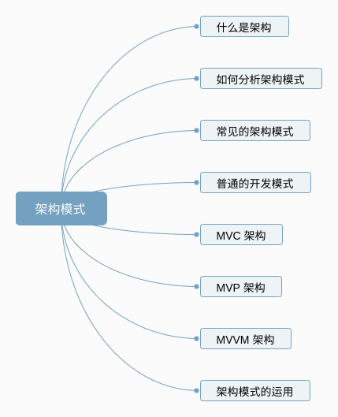
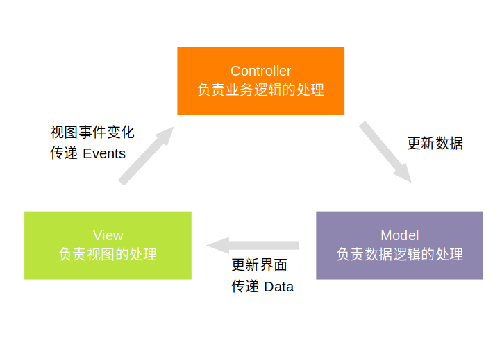

### Android 开发中的架构模式 MVC MVP MVVM
【**这是 ZY 第 15 篇原创技术文章**】   

### 预备知识 
1. 了解 Android 基本开发

### 看完本文可以达到什么程度
1. 了解如何分析一个架构模式
2. 掌握 MVC，MVP，MVVM 架构定义和实现

### 阅读前准备工作
1. clone [CommonTec](https://github.com/5A59/android-training/tree/master/common-tec/CommonTec) 项目，其中 architecture 模块是本文架构模式的对应的示例代码

### 文章概览


### 一、什么是架构
关于架构的定义，其实在很多书籍和文章中都是不同的，很难做一个统一。这里列举两个定义：    
在维基百科里是这样定义的：      
***软件架构是一个系统的草图。软件架构描述的对象是直接构成系统的抽象组件。各个组件之间的连接则明确和相对细致地描述组件之间的通讯。在实现阶段，这些抽象组件被细化为实际的组件，比如具体某个类或者对象。***      
在 IEEE 软件工程标准词汇中是这样定义的：    
***架构是以组件、组件之间的关系、组件与环境之间的关系为内容的某一系统的基本组织结构，以及指导上述内容设计与演化的原理。***       

*关于更多的定义，推荐阅读《软件架构设计：程序员向架构师转型必备》第二章*     
...    

在看过茫茫多的架构定义以后，我理解的架构是这样的：    
1. 为了解决**特定的问题**而提出   
2. 按照**特定的原则**将系统整体进行模块／组件／角色的划分   
3. 建立模块／组件／角色间的**沟通机制**      


具体解释一下，首先是要有特定的问题，没有问题空谈架构，仿佛是空中楼阁，没有实用价值，而对应到不同的问题，会有不同的解决方式。   
其次是模块的划分要根据特定的原则，没有原则随意划分，也就无从去评估一个架构的好坏。最后就是模块间的通信机制，让系统成为一个整体。     

最后，**架构模式，其实更多的是一种思想，一种规则，往往一种架构模式可能会有不同的实现方式，而实现方式之间，只有合适与否，并没有对错之分**。

### 二、如何分析一种架构模式
上面我们介绍了架构的定义，根据这个定义，我们在后面分析架构模式的时候，也会从这三方面进行。
1. 架构解决了什么问题   
知道了架构模式要解决的问题，我们才能针对性的去看，去想其解决方法是否得当，是否合适。  
2. 架构模式是如何划分角色的   
架构中最重要的就是角色 / 模块的划分，理解了架构模式中的角色划分，才能更好的理解其结构。   
3. 角色间是如何通信的   
角色间的通信也是重要的。相同的角色划分，采用不同的通信方式，往往就构成了不同的架构模式。      
角色间通信我们可以理解为数据的流向。在 Android 开发中，通信中的数据可以理解为两种，一种是**数据结构**，也就是网络请求，本地存储等通信使用的 JavaBean，另一种是**事件**，也就是控件产生的动作，包括触摸，点击，滑动等等。我们在通信过程中，也主要关注这两种数据。     
 
### 三、常见的架构模式有哪些
对于我们 Android 开发者来说，常见的架构模式基本上就是 MVC，MVP，MVVM，这三种也是开发 GUI 应用程序常见的模式。     
除此之外还有 分层模式，客户端-服务器模式(CS模式)，主从模式，管道过滤器模式，事件总线模式 等等。    
这篇文章还是具体分析 MVC，MVP，MVVM 这三种架构模式。   

### 四、不使用架构之前 App 是怎么开发的
我们在了解架构的定义以后，可能会想，为什么要用这些架构模式呢？在我们不了解这些模式之前，也是一样的开发。类似设计模式，其实架构模式的目的不是为了让应用软件开发出来，而是让结构更清晰，分工更明确，扩展更方便等等。     

我们可以看看，在不使用架构模式之前我们是怎么开发的。   
举个简单的栗子，我们界面上有 EditText，TextView，Button 三个控件，要实现的功能也比较简单：   
1. EditText 接受用户输入的内容
2. 处理用户输入的数据
3. 数据处理后输出到 TextView 中
4. 点击 Button 清空用户的输入    

界面如下：


我们看看不使用架构模式是怎么开发的，也就是我们一般常用的开发方式： 
1. 首先在 xml 设计界面
``` xml
<?xml version="1.0" encoding="utf-8"?>
<LinearLayout xmlns:android="http://schemas.android.com/apk/res/android"
    xmlns:app="http://schemas.android.com/apk/res-auto"
    xmlns:tools="http://schemas.android.com/tools"
    android:layout_width="match_parent"
    android:layout_height="match_parent"
    android:orientation="vertical"
    android:padding="10dp"
    tools:context=".MainActivity">

    <TextView
        android:id="@+id/titleText"
        android:layout_width="match_parent"
        android:layout_height="wrap_content"
        android:text="Normal" />

    <EditText
        android:id="@+id/edit"
        android:layout_width="match_parent"
        android:layout_height="50dp"
        android:textColor="@android:color/darker_gray" />

    <TextView
        android:id="@+id/msgText"
        android:layout_width="wrap_content"
        android:layout_height="30dp"
        android:layout_marginTop="10dp"
        android:text="default msg"
        android:textColor="@android:color/darker_gray" />

    <TextView
        android:id="@+id/clearText"
        android:layout_width="match_parent"
        android:layout_height="30dp"
        android:layout_marginTop="10dp"
        android:background="@color/colorPrimary"
        android:gravity="center"
        android:text="clear"
        android:textColor="@android:color/white" />
</LinearLayout>
```
2. 在 Activity / Fragment 中获取 View，进行事件监听
3. 通过 View 事件获取数据后进行处理
4. 设置处理后的数据给 View
代码如下：
``` java
class NormalFragment : Fragment() {
    companion object {
        fun newInstance(): Fragment {
            return NormalFragment()
        }
    }
    private val handler: Handler = Handler()

    override fun onCreateView(inflater: LayoutInflater, container: ViewGroup?, savedInstanceState: Bundle?): View? {
        return inflater.inflate(R.layout.architecture, container, false)
    }

    override fun onViewCreated(view: View, savedInstanceState: Bundle?) {
        super.onViewCreated(view, savedInstanceState)
        titleText.text = "NORMAL"
        edit.addTextChangedListener(object : TextWatcher {
            override fun afterTextChanged(s: Editable?) {
                handleData(s.toString())
            }

            override fun beforeTextChanged(s: CharSequence?, start: Int, count: Int, after: Int) {
            }

            override fun onTextChanged(s: CharSequence?, start: Int, before: Int, count: Int) {
            }
        })
        clearText.setOnClickListener {
            edit.setText("")
        }
    }

    // 数据的处理，真实情况下可能是网络请求，磁盘存取，大量计算逻辑等等
    private fun handleData(data: String) {
        if (TextUtils.isEmpty(data)) {
            msgText.text = "default msg"
            return
        }
        msgText.text = "handle data ..."
        handler.removeCallbacksAndMessages(null)
        // 延迟来模拟网络或者磁盘操作
        handler.postDelayed({
            msgText.text = "handled data: $data"
        }, 3000)
    }
}
```
**默认开发方式的缺点：**   
我们来分析一下上面的代码，一个明显的特点就是处理逻辑都集中在了 Activity / Fragment 中，不管是对 View 的操作，还是对数据的处理。带来的问题就是 Activity / Fragment 中逻辑臃肿，后续扩展牵一发而动全身。而且职责划分不清晰，给后续维护也带来了困难。   
既然如此，我们看看使用架构模式改造后是什么样子的。    

### 五、MVC 架构
#### 5.1 模式介绍
其实关于 MVC 架构，在不同的框架里，实现会有些差别，这也正说明了架构是一种思想。我们这里选用一种比较主流的实现。   

##### 1. 解决什么问题
我们可以看到，上面不使用架构进行开发，带来的问题是 Activity / Fragment 逻辑臃肿，不利于扩展。所以 MVC 就要解决的问题就是：**控制逻辑，数据处理逻辑和界面交互耦合**。   
*这里先插一个题外话，其实我们作为程序员，写代码不仅要实现需求，还要让代码易读，易扩展。这一点，往往也能体现功力，并不是说使用了各种奇技淫巧才是大神。*     
不知道大家是否有接触过 Java Swing 桌面应用开发，在 Java Swing 中，界面 / 控件的设置，也是用 Java 代码来实现的，如果不采用架构，最后的结果就是控制逻辑，数据处理以及页面展示的代码都集中在一个类中，读者朋友们可以想象一下，这样的代码简直是难以维护。   
##### 2. 如何划分角色
为了解决上面的问题，MVC 架构里，将逻辑，数据，界面的处理划分为三个部分，模型(Model)-视图(View)-控制器(Controller)。各个部分的功能如下：      
* Model 模型，负责数据的加载和存储。   
* View 视图，负责界面的展示。   
* Controller 控制器，负责逻辑控制。   
##### 3. 如何通信（数据的流向）
我们再看看三者之间是怎么通信的。   
在介绍通信之前，我们先解释一下通信中的数据是什么。其实在 Android 开发中，通信数据可以理解为两种，一种是**数据结构**，也就是网络请求，本地存储等通信使用的 JavaBean，另一种是**事件**，也就是控件产生的动作，包括触摸，点击，滑动等等。我们在通信过程中，也主要关注这两种数据。     
在 MVC 架构中，View 产生**事件**，通知到 Controller，Controller 中进行一系列*逻辑处理*，之后通知给 Model 去*更新数据*，Model 更新数据后，再将**数据结构**通知给 View 去更新界面。     
这就是一个完整 MVC 的数据流向。    

#### 5.2 在 Android 中的具体实现
理解了 MVC 模式，我们看看其具体实现。      
其实在 Android 开发中，其本身默认可以理解为 MVC 结构，把 View 放在 xml 中与 Java 代码解耦，然后 Activity / Fragment 充当 Controller 进行逻辑控制，但是 Android 本身并没有对 Model 进行划分，所以往往我们会让 Activity / Fragment 充当 Model 和 Controller 两个角色。而且往往 xml 中的 View 操作也是在 Activity / Fragment 中，导致有时候 Activity / Fragment 也会充当一些 View 的角色。   
所以我们在具体实现过程中，要把职责划分清楚，这里我们让 Fragment 充当 View 的角色，把 Model 和 Controller 的逻辑划分清楚。   
我们先定义三个接口如下：   
```  kotlin
// 数据模型接口，定义了数据模型的操作
interface IModel {
    fun setView(view: IView)
    // 数据模型处理输入的数据
    fun handleData(data: String)
    // 清空数据
    fun clearData()
}

// 视图接口，定义视图的操作
interface IView {
    fun setController(controller: IController)
    // 数据处理中状态
    fun dataHanding()
    // 数据处理完成，更新界面
    fun onDataHandled(data: String)
}

// 控制器接口，定义控制器的逻辑
interface IController {
    fun setModel(model: IModel)
    // EditText 数据变化，通知控制器
    fun onDataChanged(data: String)
    // 清空按钮点击事件
    fun clearData()
}
```
上面三个接口分别定义了 Model，View，Controller 的操作。有一点注意的是，根据 MVC 的通信流程，View 需要持有 Controller，Controller 需要持有 Model，Model 需要持有 View，所以需要暴露相应的接口。   
下面我们看看具体的实现：

* **Model 的实现**   

Model 中对数据的处理是添加了 "handled data: " 前缀，并增加了 3 秒的延迟。  
``` kotlin
class HandleModel : IModel {
    private var view: IView? = null
    private val handler: Handler = Handler(Looper.getMainLooper())

    override fun setView(view: IView) {
        this.view = view
    }

    // 接受到数据后，进行处理，这里设置了 3 秒的延迟，模拟网络请求处理数据的操作
    override fun handleData(data: String) {
        if (TextUtils.isEmpty(data)) {
            return
        }
        view?.dataHanding()
        handler.removeCallbacksAndMessages(null)
        // 延迟来模拟网络或者磁盘操作
        handler.postDelayed({
            // 数据处理完成，通知 View 更新界面
            view?.onDataHandled("handled data: $data")
        }, 3000)
    }

    // 接收到清空数据的事件，直接清空数据
    override fun clearData() {
        handler.removeCallbacksAndMessages(null)
        // 数据清空后，通知 View 更新界面
        view?.onDataHandled("")
    }
}
```

* **Controller 的实现**   

Controller 的实现比较简单，将操作直接转发给 Model，实际上，对于复杂的业务场景，这里要处理很多业务逻辑。
``` kotlin
class HandleController : IController {
    private var model: IModel? = null

    override fun onDataChanged(data: String) {
        model?.handleData(data)
    }

    override fun clearData() {
        model?.clearData()
    }

    override fun setModel(model: IModel) {
    }
}
```

* **View 的实现**    

这里 Fragment 充当了 View 的角色，主要负责将 View 的事件传递给 Controller，以及接受到 Model 的数据进行界面更新。
``` kotlin
class MVCFragment : Fragment(), IView {

    companion object {
        fun newInstance(): Fragment {
            return MVCFragment()
        }
    }

    private val model: IModel = HandleModel()
    private var controller: IController = HandleController()

    override fun onCreateView(inflater: LayoutInflater, container: ViewGroup?, savedInstanceState: Bundle?): View? {
        return inflater.inflate(R.layout.architecture, container, false)
    }

    override fun onViewCreated(view: View, savedInstanceState: Bundle?) {
        super.onViewCreated(view, savedInstanceState)
        setController(controller)
        model.setView(this)

        titleText.text = "MVC"
        edit.addTextChangedListener(object : TextWatcher {
            override fun afterTextChanged(s: Editable?) {
                // 通知 Controller 输入的数据产生变化
                controller?.onDataChanged(s.toString())
            }

            override fun beforeTextChanged(s: CharSequence?, start: Int, count: Int, after: Int) {
            }

            override fun onTextChanged(s: CharSequence?, start: Int, before: Int, count: Int) {
            }
        })
        clearText.setOnClickListener {
            // 通知 Controller 清空数据事件
            controller?.clearData()
        }
    }

    // Model 数据变化，进行界面更新
    override fun onDataHandled(data: String) {
        if (TextUtils.isEmpty(data)) {
            edit.setText("")
            msgText.text = "default msg"
        } else {
            msgText.text = data
        }
    }

    // Model 数据变化，进行界面更新
    override fun dataHanding() {
        msgText.text = "handle data ..."
    }

    override fun setController(controller: IController) {
        this.controller = controller
    }
}
```
这样我们就实现了一个简单的 MVC 结构。

#### 5.3 MVC 架构模式的优缺点
优点：   
1. 结构清晰，职责划分清晰   
2. 降低耦合   
3. 有利于组件重用    

缺点：    
1. 其实我们上述的示例，已经是经过优化的 MVC 结构了，一般来说，Activity / Fragment 会承担 View 和 Controller 两个角色，就会导致 Activity / Fragment 中代码较多   
2. Model 直接操作 View，View 的修改会导致 Controller 和 Model 都进行改动   
3. 增加了代码结构的复杂性   

### 六、MVP 架构
#### 6.1 模式介绍

##### 1. 解决什么问题
MVP 要解决的问题和 MVC 大同小异：**控制逻辑，数据处理逻辑和界面交互耦合，同时能将 MVC 中的 View 和 Model 解耦**。   
##### 2. 如何划分角色
MVP 架构里，将逻辑，数据，界面的处理划分为三个部分，模型(Model)-视图(View)-控制器(Presenter)。各个部分的功能如下：      
* Model 模型，负责数据的加载和存储。     
* View 视图，负责界面的展示。    
* Presenter 控制器，负责逻辑控制。    
##### 3. 如何通信（数据的流向）
我们可以看到，MVP 中的各个角色划分，和 MVC 基本上相似，那么区别在哪里呢？区别就在角色的通信上。    

MVP 和 MVC 最大的不同，就是 View 和 Model 不相互持有，都通过 Presenter 做中转。View 产生**事件**，通知给 Presenter，Presenter 中进行*逻辑处理*后，通知 Model *更新数据*，Model 更新数据后，通知**数据结构**给 Presenter，Presenter 再通知 View 更新界面。     
`
这就是一个完整 MVP 的数据流向。   

#### 6.2 在 Android 中的实现
理解了 MVP 之后，我们看一下其具体实现。   
首先我们定义三个接口：
``` kotlin
// 模型接口，定义了数据模型的操作
interface IModel {
    fun setPresenter(presenter: IPresenter)
    // 梳理数据
    fun handleData(data: String)
    // 清除数据
    fun clearData()
}

// 视图接口，定义了视图的操作
interface IView {
    fun setPresenter(presenter: IPresenter)
    // 数据处理中视图
    fun loading()
    // 数据展示
    fun showData(data: String)
}

// 控制器，定义了逻辑操作
interface IPresenter {
    fun setView(view: IView)
    fun setModel(model: IModel)
    // Model 处理完成数据通知 Presenter
    fun dataHandled(data: String)
    // Model 清除数据后通知 Presenter
    fun dataCleared()
    // View 中 EditText 文字变化后通知 Presenter
    fun onTextChanged(text: String)
    // View 中 Button 点击事件通知 Presenter
    fun onClearBtnClicked()
}
```
上面定义了 View，Model，Presenter 三个接口，其中 View 和 Model 会持有 Presenter，Presenter 持有 View 和 Model。   
接着看下接口的实现：

* **Model 的实现**    

``` kotlin
class HandleModel : IModel {
    private var presenter: IPresenter? = null
    private var handler = Handler(Looper.getMainLooper())

    override fun handleData(data: String) {
        if (TextUtils.isEmpty(data)) {
            return
        }
        handler.removeCallbacksAndMessages(null)
        // 延迟来模拟网络或者磁盘操作
        handler.postDelayed({
            // 数据处理完成，通知 Presenter
            presenter?.dataHandled("handled data: $data")
        }, 3000)
    }

    override fun clearData() {
        handler.removeCallbacksAndMessages(null)
        // 数据清理完成，通知 Presenter
        presenter?.dataCleared()
    }

    override fun setPresenter(presenter: IPresenter) {
        this.presenter = presenter
    }

}
```
Model 的实现和前面 MVC 中的实现基本一致，不过在 MVC 中 Model 直接操作 View 进行视图展示，而在 MVP 里，要通知 Presenter 去中转。  

* **View 的实现**   

这里依旧是 Fragment 充当了 View 的角色，主要负责将 View 的事件传递给 Presenter，以及接受到 Presenter 的数据进行界面更新。
``` kotlin
class MVPFragment : Fragment(), IView {

    companion object {
        fun newInstance(): Fragment {
            val presenter = Presenter()
            val fragment = MVPFragment()
            val model = HandleModel()
            fragment.setPresenter(presenter)
            model.setPresenter(presenter)
            presenter.setModel(model)
            presenter.setView(fragment)
            return fragment
        }
    }

    var mpresenter: IPresenter? = null

    override fun onCreateView(inflater: LayoutInflater, container: ViewGroup?, savedInstanceState: Bundle?): View? {
        return inflater.inflate(R.layout.architecture, container, false)
    }

    override fun onViewCreated(view: View, savedInstanceState: Bundle?) {
        super.onViewCreated(view, savedInstanceState)
        titleText.text = "MVP"

        edit.addTextChangedListener(object : TextWatcher {
            override fun afterTextChanged(s: Editable?) {
                // 传递 文字修改 事件给 Presenter
                mpresenter?.onTextChanged(s.toString())
            }

            override fun beforeTextChanged(s: CharSequence?, start: Int, count: Int, after: Int) {
            }

            override fun onTextChanged(s: CharSequence?, start: Int, before: Int, count: Int) {
            }
        })
        clearText.setOnClickListener {
            // 传递按钮点击事件给 Presenter
            mpresenter?.onClearBtnClicked()
        }
    }

    override fun setPresenter(presenter: IPresenter) {
        this.mpresenter = presenter
    }

    // 展示数据处理中的视图
    override fun loading() {
        msgText.text = "handling data ..."
    }

    // 展示处理后的数据
    override fun showData(data: String) {
        msgText.text = data
    }
}
```

* **Presenter 的实现**   

这里 Presenter 的实现比较简单，没有太多的业务逻辑，实际应用中，这里会进行业务逻辑的处理。
``` kotlin
class Presenter : IPresenter {
    private var model: IModel? = null
    private var view: IView? = null

    override fun setModel(model: IModel) {
        this.model = model
    }

    override fun setView(view: IView) {
        this.view = view
    }

    override fun dataHandled(data: String) {
        view?.showData(data)
    }

    override fun dataCleared() {
        view?.showData("")
    }

    override fun onTextChanged(text: String) {
        view?.loading()
        model?.handleData(text)
    }

    override fun onClearBtnClicked() {
        model?.clearData()
    }
}
```

#### 6.3 MVP 架构模式的优缺点
优点：   
1. 结构清晰，职责划分清晰    
2. 模块间充分解耦    
3. 有利于组件的重用    

缺点：    
1. 会引入大量的接口，导致项目文件数量激增    
2. 增大代码结构复杂性    

### 七、MVVM 架构
#### 7.1 模式介绍

##### 1. 解决什么问题
MVVM 要解决的问题和 MVC，MVP 大同小异：**控制逻辑，数据处理逻辑和界面交互耦合**，并且同时能将 MVC 中的 View 和 Model 解耦，还可以把 MVP 中 Presenter 和 View 也解耦。   
##### 2. 如何划分角色
MVVM 架构里，将逻辑，数据，界面的处理划分为三个部分，模型(Model)-视图(View)-逻辑(ViewModel)。各个部分的功能如下：      
* Model 模型，负责数据的加载和存储。   
* View 视图，负责界面的展示。   
* ViewModel 控制器，负责逻辑控制。   
##### 3. 如何通信（数据的流向）
我们可以看到，MVP 中的各个角色划分，和 MVC，MVP 基本上相似，区别也是在于角色的通信上。    

我们上面说到，在 MVP 中，就是 View 和 Model 不相互持有，都通过 Presenter 做中转。这样可以使 View 和 Model 解耦。     

而在 MVVM 中，解耦做的更彻底，ViewModel 也不会持有 View。其中 ViewModel 中的改动，会自动反馈给 View 进行界面更新，而 View 中的事件，也会自动反馈给 ViewModel。     

要达到这个效果，当然要使用一些工具辅助，比较常用的就是 databinding。    
在 MVVM 中，数据的流向是这样的：   
View 产生**事件**，**自动**通知给 ViewMode，ViewModel 中进行*逻辑处理*后，通知 Model *更新数据*，Model 更新数据后，通知**数据结构**给 ViewModel，ViewModel **自动**通知 View 更新界面。    
这就是一个完整 MVVM 的数据流向。   

#### 7.2 在 Android 中的实现
MVVM 的实现会复杂一点，我们先看下接口的定义：
``` kotlin
// ViewModel 接口，定义了逻辑操作
interface IViewModel {
    fun setModel(model: IModel)
    fun handleText(text: String?)
    fun clearData()
    fun dataHandled(data: String?)
    fun dataCleared()
}

// 模型接口，定义了数据操作
interface IModel {
    fun setViewModel(viewModel: IViewModel)
    fun handleData(data: String?)
    fun clearData()
}
```
MVVM 中的接口只定义了 ViewModel 和 Model，没有 View 接口，是因为 View 是通过 databind 和 ViewModel 的。  
我们再看看具体实现：

* **Model 实现**    

Model 的实现和上面基本一致，就是对数据的处理，处理完成后通知 ViewModel。
``` kotlin
class HandleModel : IModel {
    private var viewModel: IViewModel? = null
    private var handler = Handler(Looper.getMainLooper())

    override fun handleData(data: String?) {
        if (TextUtils.isEmpty(data)) {
            return
        }
        handler.removeCallbacksAndMessages(null)
        // 延迟来模拟网络或者磁盘操作
        handler.postDelayed({
            // 数据处理完成通知 ViewModel
            viewModel?.dataHandled("handled data: $data")
        }, 3000)
    }

    override fun clearData() {
        handler.removeCallbacksAndMessages(null)
        // 数据清理完成通知 ViewModel
        viewModel?.dataCleared()
    }

    override fun setViewModel(viewModel: IViewModel) {
        this.viewModel = viewModel
    }
}
```

* **ViewModel 实现**   

ViewModel 的实现要有些不同，我们采用 databind 进行 ViewModel 和 View 的绑定。
其中会定义两个变量，inputText 是和 EditText 双向绑定的数据，handledText 是和 TextView 双向绑定的数据。
当 EditText 中输入的数据有变化，会通知到 inputText 注册的监听器中，而 handledText 值的改变，会自动显示到界面上。
``` kotlin
class ViewModel : IViewModel {
    private var model: IModel? = null
    // View 绑定的数据，inputText 和 handledText 更新后会自动通知 View 更新界面
    var inputText: MutableLiveData<String> = MutableLiveData()
    var handledText: MutableLiveData<String> = MutableLiveData()

    init {
        // 注册数据监听，数据改变后通知 Model 去处理数据
        inputText.observeForever {
            handleText(it)
        }
        handledText.value = "default msg"
    }

    override fun handleText(text: String?) {
        if (TextUtils.isEmpty(text)) {
            handledText.value = "default msg"
            return
        }
        handledText.value = "handle data ..."
        model?.handleData(text)
    }

    // 清空按钮的点击事件绑定
    override fun clearData() {
        model?.clearData()
    }

    override fun setModel(model: IModel) {
        this.model = model
        model.setViewModel(this)
    }

    // Model 数据处理完成，设置 handledText 的值，自动更新到界面
    override fun dataHandled(data: String?) {
        handledText.value = data
    }

    // Model 数据处理完成，设置 inputText 的值，自动更新到界面
    override fun dataCleared() {
        inputText.value = ""
    }
}
```

* **View 实现**   

看一下 View 中的数据绑定。
``` kotlin
class MVVMFragment : Fragment() {
    companion object {
        fun newInstance(): Fragment {
            return MVVMFragment()
        }
    }

    override fun onCreateView(inflater: LayoutInflater, container: ViewGroup?, savedInstanceState: Bundle?): View? {
        // 使用 databind 进行数据绑定
        var binding: ArchitectureBindingBinding = DataBindingUtil.inflate(inflater, R.layout.architecture_binding, container, false)
        binding.lifecycleOwner = this
        val viewModel = ViewModel()
        viewModel.setModel(HandleModel())
        binding.viewmodel = viewModel
        return binding.root
    }
}
```

``` xml
<?xml version="1.0" encoding="utf-8"?>
<layout xmlns:android="http://schemas.android.com/apk/res/android"
    xmlns:app="http://schemas.android.com/apk/res-auto"
    xmlns:tools="http://schemas.android.com/tools">

    <!--定义 View 中绑定的数据-->
    <data>
        <variable
            name="viewmodel"
            type="com.zy.architecture.mvvm.ViewModel" />
    </data>

    <LinearLayout
        android:layout_width="match_parent"
        android:layout_height="match_parent"
        android:orientation="vertical"
        android:padding="10dp"
        tools:context=".MainActivity">

        <TextView
            android:id="@+id/titleText"
            android:layout_width="match_parent"
            android:layout_height="wrap_content"
            android:text="MVVM" />

        <!--双向绑定 inputText 到 EditText-->
        <EditText
            android:id="@+id/edit"
            android:layout_width="match_parent"
            android:layout_height="50dp"
            android:text="@={viewmodel.inputText}" 
            android:textColor="@android:color/darker_gray" />

        <!--绑定 handledText 到 TextView-->
        <TextView
            android:id="@+id/msgText"
            android:layout_width="wrap_content"
            android:layout_height="30dp"
            android:layout_marginTop="10dp"
            android:text="@{viewmodel.handledText}"
            android:textColor="@android:color/darker_gray" />

        <!--绑定清空数据的点击事件 到 TextView-->
        <TextView
            android:id="@+id/clearText"
            android:layout_width="match_parent"
            android:layout_height="30dp"
            android:layout_marginTop="10dp"
            android:background="@color/colorPrimary"
            android:gravity="center"
            android:onClick="@{() -> viewmodel.clearData()}"
            android:text="clear"
            android:textColor="@android:color/white" />
    </LinearLayout>
</layout>
```
通过上面的实现，当 EditText 中文字变化后，会自动修改 inputText 的值，触发 inputText 监听器，此时 ViewModel 将消息传递给 Model 进行处理，Model 数据处理完成后，通知 ViewModel 更新 handledText 的值，自动更新到界面上。     
点击清空按钮时，自动调用绑定的点击函数，通知 ViewModel 清空事件，ViewModel 将消息传递给 Model 进行数据清空，Model 数据处理完成后，通知 ViewModel 进行界面更新。   

#### 7.3 MVVM 架构模式的优缺点
优点：
1. 结构清晰，职责划分清晰   
2. 模块间充分解耦   
2. 在 MVP 的基础上，MVVM 把 View 和 ViewModel 也进行了解耦    

缺点：
1. Debug 困难，由于 View 和 ViewModel 解耦，导致 Debug 时难以一眼看出 View 的事件传递
2. 代码复杂性增大

### 八、架构模式的运用
上面的文章中，我们介绍了 MVC，MVP，MVVM 三种架构模式，以及其简单的实现。这里我们再回过头思考一下，什么时候该使用架构模式呢？       
架构模式可以使代码模块清晰，职责分工明确，容易扩展，带来的副作用就是会引入大量的接口，导致代码文件数量激增。     
我们在最开始说过，架构模式是用来解决特定的问题的，如果特定的问题在目前阶段不是问题，或者不是主要问题，那么我们可以先不考虑使用架构模式。比如一个功能非常简单，代码量少，而后续又没有扩展的需求，那我们直接使用传统方式进行开发，快速且清晰，完全没有必要为了架构而架构。        
对于在开始没有考虑架构模式的代码，后续慢慢去**重构**，也是一个好的选择。     

总结来说就是：**架构虽好，可不要贪杯哦~**   

### 总结


### 参考
https://www.infoq.cn/article/an-informal-discussion-on-architecture-part01   
https://zh.wikipedia.org/wiki/软件架构   
https://www.jianshu.com/p/4ce4dcb43315   
《软件架构设计--程序员向架构师转型必备》   
《架构实战》   
《架构之美》   